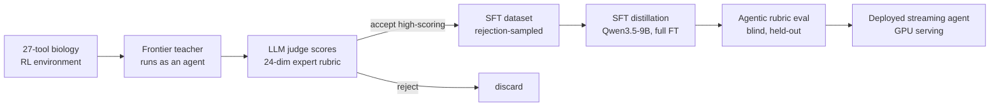

# Fine-tuning Open-source Models for Target Prioritization Workflows

Tumor-associated antigen (TAA) target prioritization is a very important step in evaluating a target for CAR-T/TCE/antibody modalities in drug discovery and much of the workflow know-how is locked in the minds of industry experts. This workflow is long-horizon and consists of querying ~20 public/internal sources and then reasoning on the data from those sources to produce the final evaluation for the target(s). An example query could be: 

```
Evaluate PTK7 as a candidate cell-surface ADC target for non-small cell lung cancer (NSCLC).
```
In addition, open-source models are getting better and pharma companies increasingly want their own proprietary models for drug development workflows, perhaps due to the high cost of frontier models, unavailability of frontier models (i.e. in China), or the fear of frontier labs becoming pharma competitors. In this project, Qwen3.5-9B was fine-tuned to do tumor-associated antigen (TAA) target prioritization using SFT. A 27-tool RL environment and 24-dimension rubric were co-designed with an industry expert and built to facilitate LLM-judge rejection-sampling distillation. SFT with assistant-token loss masking was then done on high-scoring trajectories from a frontier model.


The fine-tuned 9B scores **3.75 / 5** on 14 held-out target queries, compared to **1.94 / 5** on Qwen3.5-9B base model. The fine-tuned 9B also beats the base model when it was conditioned on the rubric (2.05 / 5), and approaches the frontier teacher (4.36 / 5). 

You can try the agent here: [models.frontwind.ai/agent](https://models.frontwind.ai/agent).

---

## System overview



---

## 1. The environment (verifiable, single-source tools)

The agent operates in a live, read-only biology environment of 27 tools, connecting to databases such as UniProt, TCGA, GTEx, Human Protein Atlas, CPTAC/PDC proteomics, DepMap, Open Targets, cBioPortal, PaxDb, PubMed, ClinicalTrials/AACT, and more. The agent is also given a `code_exec` tool which allows it to run code in a sandbox and save files (i.e. graphs). The agent is given the ability to read and write files in a sandbox directory. Some tools may return CSVs, like per-sample gene expression from TCGA.

## 2. The reward: a 24-dimension expert rubric

Quality of a trajectory is defined by a 24-dimension rubric co-designed with an industry expert (20 years experience in big pharma, Director of R&D) spanning the real decision criteria for a surface target: surface accessibility and topology, tumor-vs-normal differential expression, normal-tissue safety, shedding, isoform structure, molecular-subtype dependence, connection to cancer drivers, competitive/clinical landscape. Each dimension has a description for 5 (full marks) and 1 (poor). Many dimensions require a specific figure with an exact spec (chart type, axes, what each point is), which can be generated using the `code_exec` tool — so a missing or wrong figure is dockable. The rubric is the reward signal for both data selection and evaluation.

## 3. Data: LLM-judge rejection-sampling distillation

The SFT set is built by **rejection sampling** the teacher's trajectories:

1. **Generate** — a frontier model (Claude Sonnet 5) runs as an agent over the environment on a spread of target queries, producing full multi-tool trajectories (reasoning + tool calls + figures + final report). The frontier model is given the rubric in the system prompt and told to produce a trajectory that will score full marks. 
2. **Judge** — an LLM judge (Claude Opus 4.8) scores each trajectory on all 24 rubric dimensions.
3. **Filter** — keep only trajectories clearing >=4 avg. score and ==5 on evidence faithfulness dimensions.

## 4. Training

- **Teacher:** Claude Sonnet 5.
- **Student:** Qwen3.5-9B.
- **Objective:** SFT with assistant-token loss masking.
- **Scale:** full-parameter fine-tune via DeepSpeed ZeRO-2 with CPU optimizer offload on 2×H100.
- **Dataset:** 142 filtered trajectories from teacher model.

Note: Mid-trajectory reasoning turns from Claude Sonnet 5 were put into `<think></think>` tags in the Qwen chat template. 

## 5. Results

Models were evaluated on 14 held-out targets queries, judged by Claude Sonnet 5 against the 24-dimension rubric (1–5). "Blind" = no rubric in the prompt; "conditioned" = rubric injected. 

| Model | Mean (single-target) | Figures rendered |
|---|---|---|
| Base 9B, blind | 1.94 | 0-1 |
| Base 9B, rubric-conditioned | 2.05 | 0-1 |
| **Fine-tuned 9B, blind** | **3.75** | 8-12 |
| Teacher (reference) | 4.36 | 8-12 |


Full trajectory examples here: ** [models.frontwind.ai/examples](https://models.frontwind.ai/examples)** — PTK7 & CLDN6, fine-tuned vs. base, side by side.

## 6. Next Steps

- Larger SFT dataset.
- On-policy RL (RLVR).
- Specialize to adjacent workflows: (HTE validation, bispecific target-prio) that share tools but use different rubrics.
