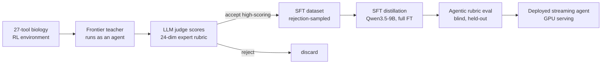

# Fine-tuning Open-source Models for Target Prioritization Workflows

In this project, Qwen3.5-9B was fine-tuned to do tumor-associated antigen (TAA) target prioritization, a very important step in evaluating a target for CAR-T/TCE/antibody modalities in drug discovery and a workflow filled with expert knowledge (see examples below). Open-source models are getting better and pharma companies want their own proprietary models for drug development workflows (maybe Claude is too expensive or it cannot be used, like in China). This TAA target-prio workflow is long-horizon and uses tool calls from ~20 public/internal sources to produce the final evaluation for a target. An example query could be: 

```
Evaluate PTK7 as a candidate cell-surface ADC target for non-small cell lung cancer (NSCLC).
```
 

The fine-tuned 9B scores **3.75 / 5** on 14 held-out target queries, compared to **1.94 / 5** on Qwen3.5-9B base model. The fine-tuned 9B also beats the base model when it was conditioned on the rubric (2.05 / 5), and approaches the frontier teacher (4.36 / 5). 

You can try the agent here: [models.frontwind.ai/agent](https://models.frontwind.ai/agent).

---

## System overview



---

## 1. The environment (verifiable, single-source tools)

The agent operates in a live, read-only biology environment of ~27 tools, connecting to databases such as UniProt, TCGA, GTEx, Human Protein Atlas, CPTAC/PDC proteomics, DepMap, Open Targets, cBioPortal, PaxDb, PubMed, ClinicalTrials/AACT, and more. The agent is also given a `code_exec` tool which allows it to run code in a sandbox and save files (i.e. graphs). The agent is given the ability to read and write files in a sandbox directory. Some tools may return CSVs, like per-sample gene expression from TCGA.

## 2. The reward: a 24-dimension expert rubric

Quality of a trajectory is defined by a 24-dimension rubric co-designed with an industry expert (20 years experience in big pharma, Director of R&D) spanning the real decision criteria for a surface target: surface accessibility and topology, tumor-vs-normal differential expression, normal-tissue safety, shedding, isoform structure, molecular-subtype dependence, connection to cancer drivers, competitive/clinical landscape. Many dimensions require a specific figure with an exact spec (chart type, axes, what each point is), which can be generated using the `code_exec` tool — so a missing or wrong figure is dockable. The rubric is the reward signal for both data selection and evaluation.

## 3. Data: LLM-judge rejection-sampling distillation

The SFT set is built by **rejection sampling** the teacher's trajectories:

1. **Generate** — a frontier model (Claude Sonnet 5) runs as an agent over the environment on a spread of target queries, producing full multi-tool trajectories (reasoning + tool calls + figures + final report). The frontier model is given the rubric in the system prompt and told to produce a trajectory that will score full marks. 
2. **Judge** — an LLM judge (Claude Opus 4.8) scores each trajectory on all 24 rubric dimensions.
3. **Filter** — keep only trajectories clearing >=4 avg. score and ==5 on evidence faithfulness dimensions. In one build, **142 trajectories were kept and ~277 rejected.**

## 4. Training

- **Teacher:** Claude Sonnet 5.
- **Student:** Qwen3.5-9B.
- **Objective:** SFT with assistant-token loss masking.
- **Scale:** full-parameter fine-tune via DeepSpeed ZeRO-2 with CPU optimizer offload on 2×H100.
- **Dataset:** 142 filtered trajectories from teacher model.

Note: Mid-trajectory reasoning turns from Claude Sonnet 5 were put into `<think></think>` tags in the Qwen chat template. 

## 5. Results

Models were evaluated **agentically on 18 held-out targets** (queries held out from training), judged by **Claude Sonnet 5** against the 24-dimension rubric (1–5). "Blind" = no rubric in the prompt; "conditioned" = rubric injected. The fine-tuned model is served **blind**.

| Model (n = 18) | Mean rubric score | Acceptable (≥3) | Figures / report |
|---|---|---|---|
| Base Qwen3.5-9B, blind | 1.83 | 1 / 18 | 0–1 |
| Base Qwen3.5-9B, **rubric-conditioned** | 1.94 | 0 / 18 | 0–1 |
| **Fine-tuned Qwen3.5-9B, blind (ours)** | **2.75** | **11 / 18** | **7–13** |
| Teacher — Claude Sonnet 5 (reference¹) | 4.32 | 18 / 18 | 8–12 |

¹ *Teacher scores are the rejection-sampling-kept trajectories (≥4.0 filter), so 4.32 is a selection-biased ceiling, not a fresh run.*

On **single-target** prioritization (n = 14 — the training distribution), excluding multi-target comparison queries:

| Model | Mean (single-target) | Acceptable (≥3) |
|---|---|---|
| Base 9B, blind | 1.94 | 1 / 14 |
| Base 9B, rubric-conditioned | 2.05 | 0 / 14 |
| **Fine-tuned 9B, blind** | **3.15** | **11 / 14 (79%)** |
| Teacher (reference) | 4.36 | 14 / 14 |

**What this shows.** Distillation lifts the 9B from ~1.9 (base) to **3.15/5 on single-target prioritization (79% expert-acceptable)** — and **beats the base model even when the base is handed the rubric** (2.05 → 3.15), so the behavior is internalized in the *weights*, not promptable. It also produces 7–13 rendered figures per report where the base produces essentially none.

**Where it fails.** Multi-target *comparison* queries (0 / 4) and tool-error-heavy runs: the model spends its whole tool-call budget gathering (and retrying failed calls) and never reaches synthesis — the forced final answer is a half-written figure call, so it renders 0 figures and scores ~1. This is a **pacing / budget-allocation** weakness, not degeneration or a reasoning failure (the reasoning stays on-task throughout).

### Example trajectories (base vs. fine-tuned, held-out targets)

Same environment, judged blind. The base model — *even handed the rubric* — writes meta-framed prose with **zero figures**; the fine-tuned model reasons **surface-gate-first** in an expert voice, calls the right tools, and renders **9–17 real figures**. On PTK7 the two even reach **opposite recommendations**.

**PTK7 — ADC target, NSCLC**

| | Base 9B (rubric-conditioned) | Fine-tuned 9B (blind) |
|---|---|---|
| Tool calls | 44 | 60 |
| Figures rendered | **0** | **15** |
| Opening reasoning | *"The user wants me to evaluate PTK7… I need to gather comprehensive data across multiple dimensions…"* | *"I'll systematically gather evidence across all the key dimensions for PTK7 as an NSCLC ADC target. Let me start with the foundational calls in parallel."* |
| Recommendation | *"**REJECT / DO NOT PURSUE** — PTK7 fails to meet the critical thresholds…"* | *"**Bottom line up front:** PTK7 is a real, clinically precedented ADC target in NSCLC with a genuine tumor-vs-normal window (LUAD log2FC 0.55, LUSC log2FC 0.59)…"* |

*(PTK7 is a clinically-precedented ADC target — e.g. cofetuzumab pelidotin / PF-06647020. The base model rejects it, unsupported by any figure; the fine-tuned model recommends it with a quantified expression window and 15 rendered figures.)*

**CLDN6 — CAR-T / bispecific, ovarian**

| | Base 9B (rubric-conditioned) | Fine-tuned 9B (blind) |
|---|---|---|
| Tool calls | 36 | 60 |
| Figures rendered | **0** | **9** |
| Opening reasoning | *"The user wants me to assess CLDN6… I need to systematically evaluate this target…"* | *"I'll systematically gather evidence… starting with the foundational surface-accessibility gate…"* |
| Assessment | *"CLDN6 shows EXCELLENT tumor/normal specificity…"* (prose only) | *"**Bottom line up front:** CLDN6 clears the surface-accessibility gate cleanly, shows an outstanding tumor:normal window…"* (+ 9 figures) |

### Full trajectories

Browse complete runs — every reasoning turn, tool call, tool result, and the final report with rendered figures:

**▶ [models.frontwind.ai/examples](https://models.frontwind.ai/examples)** — PTK7 & CLDN6, fine-tuned vs. base, side by side.

## 6. Next Steps

- **Fix the dominant failure (pacing).** Reserve tool-call budget for synthesis — force synthesis earlier and signal *"N calls left, stop gathering and write the report"* — and scale the budget to the number of targets so multi-target comparisons finish. This alone should recover most of the 6/18 failures.
- **Add multi-target + pacing-pressure trajectories** to the SFT set (comparisons are currently out-of-distribution → 0/4) and make tool-error handling skip-and-note instead of retry-looping.
- **On-policy RL (RLVR)** rewarding *completed* reports, not just gathered evidence.
- **Larger, multi-sample eval** for tighter statistics and a fresh (unbiased) teacher baseline.
- **Specialize to adjacent workflows** (HTE validation, bispecific target-prio) that share tools but use different rubrics.
