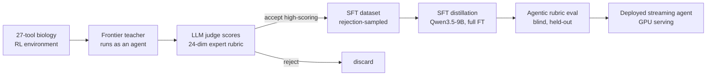

# Fine-tuning Open-source Models for Target Prioritization Workflows

Large language models are strong at short-horizon Q&A but unreliable on **long-horizon, multi-tool expert workflows** — the kind where the answer requires gathering evidence from a dozen data sources, reasoning over it against domain-specific criteria, and synthesizing a calibrated recommendation. This project builds the full pipeline to teach a small open model one such workflow: **prioritizing cell-surface proteins as therapeutic targets** (for CAR-T / ADC / bispecific modalities) in oncology.

The recipe is **rejection-sampling distillation from a frontier teacher, filtered by an LLM judge against a co-designed expert rubric.** A frontier model runs as an agent inside a purpose-built **27-tool biology environment**; each trajectory is scored on a **24-dimension expert rubric** by an LLM judge; only high-scoring trajectories become supervised fine-tuning (SFT) data for a **Qwen3.5-9B** student.

The headline result: after fixing a subtle training-format bug, the fine-tuned 9B scores **4.21 / 5** on a held-out target (blind, no rubric in the prompt) — **beating the base model that was *handed* the rubric by ~2 points**, and approaching the frontier teacher (~4.6). The rubric-quality behavior is genuinely **distilled into the weights**, not promptable. The model is deployed as a live streaming agent.

---

## System overview

---

## 1. The environment (verifiable, single-source tools)

The agent operates in a **live, read-only biology environment** of ~27 tools — each a pure connector to one real data source (UniProt, TCGA, GTEx, Human Protein Atlas, CPTAC/PDC proteomics, DepMap, Open Targets, cBioPortal, PaxDb, PubMed, ClinicalTrials/AACT, and more). Design constraints that make it a good post-training environment:

- **Live-only.** Every tool returns real data from a public API or a shipped reference table that *is* the primary source — no synthetic or curated shortcuts.
- **Tools return raw facts, not judgments.** No tool returns a threshold, verdict, or interpretation that would leak the rubric — the *model* must supply all reasoning. A scrub step at the tool boundary strips any commentary keys.
- **A sandboxed code-execution tool** lets the agent write Python to analyze retrieved data and render figures (the deliverable includes plots, not just prose).

This is effectively an **RL environment with verifiable structure**: a fixed action space (tool calls), real observations, and a reward defined by a rubric (below).

## 2. The reward: a 24-dimension expert rubric

Quality is defined by a **co-designed, versioned rubric** of ~24 dimensions spanning the real decision criteria for a surface target: surface accessibility and topology, tumor-vs-normal differential expression, normal-tissue safety, shedding, isoform structure, molecular-subtype dependence, connection to cancer drivers, competitive/clinical landscape, and a hard **"surface gate"** (a target that isn't truly surface-accessible should be rejected early, not scored on downstream criteria). Many dimensions require a **specific figure** with an exact spec (chart type, axes, what each point is) — so a missing or wrong figure is dockable. The rubric is the reward signal for both data selection and evaluation.

## 3. Data: LLM-judge rejection-sampling distillation

The SFT set is built by **rejection sampling** the teacher's trajectories:

1. **Generate** — a frontier model (Claude) runs as an agent over the environment on a spread of target queries, producing full multi-tool trajectories (reasoning + tool calls + figures + final report).
2. **Judge** — an LLM judge scores each trajectory on all 24 rubric dimensions (with a one-sentence reason for every non-perfect dimension).
3. **Filter** — keep only trajectories clearing a quality bar (judge average + faithfulness and surface-gate floors); **reject the rest**. In one build, **142 trajectories were kept and ~277 rejected.**

The kept trajectories are converted to chat-format SFT examples. Crucially, the student is trained with the **blind** system prompt (no rubric) — the rubric is scaffolding for the teacher and data selection, to be *internalized* by the student. (This is the off-policy, distillation flavor of STaR / RFT / ReST-style rejection-sampling fine-tuning.)

## 4. Training

- **Student:** Qwen3.5-9B (a gated-delta-rule *linear-attention* model).
- **Objective:** SFT with **assistant-token loss masking** — tool results are in context but never trained on, so the model never learns to hallucinate tool outputs.
- **Scale:** full-parameter fine-tune via **DeepSpeed ZeRO-2 with CPU optimizer offload** on 2×H100 (ZeRO-3 was off-limits — a custom sparse-logits trainer calls the decoder submodule directly, which ZeRO-3's parameter partitioning breaks). A chunked, checkpointed cross-entropy over only the trained positions keeps the 64K-token logits from OOMing.

## 5. Key findings (the interesting part)

Most of the engineering value was in **diagnosis**, not the training loop.

- **Root cause of every early failure: empty `<think>` blocks.** Qwen3.5 is a *thinking* model, but the teacher's per-turn reasoning was stored as ordinary assistant `content`, so the chat template rendered an **empty** `<think>\n\n</think>` on every one of ~1,000 assistant turns. The student learned to *open-then-immediately-close* the think block — i.e., to suppress reasoning — then filled it anyway at inference (base-model residue), landed out-of-distribution, and degenerated. **Fix:** route the teacher's reasoning into `reasoning_content` so it renders *inside* `<think>`. This single data change was the difference between "unusable" and "near-frontier."
- **`eval_loss` is a trap.** The next-token eval loss looked *fine* (0.29–0.40) the entire time the model was agentically unusable, and the best-eval-loss epoch was not obviously best. Only the **separate agentic rubric eval** — which cannot run inside the training loop — detects the real failure. If you post-train agents, do not trust a token-level proxy.
- **Three eval-harness bugs each silently zeroed the score** — a stop-token mismatch (generation ran past the turn boundary and self-generated empty-think turns), a too-small `max_new_tokens` that truncated every final report, and a full-disk figure path that made the model fabricate data instead of plotting. Each looked like a *model* failure; all three were harness bugs. **Verify your eval harness before trusting any number.**
- **Serving budget matters as much as the model.** A *bounded* budget (force synthesis after N tool calls) beat an unbounded one — the model over-gathers (60–92 calls, once 68 figures) and paces itself poorly. Pacing is a distinct, unsolved weakness even in the good model.

## 6. Results

All scores are on the **same held-out targets**, judged by a frontier LLM against the 24-dimension rubric (1–5). "Blind" = no rubric in the prompt; "conditioned" = rubric injected.

| Model | PTK7 (NSCLC) | CLDN6 (ovarian) | Figures produced |
|---|---|---|---|
| Broken 9B (empty-`<think>`) | 1.08 | 1.88 | 0–1 |
| Base 9B, **rubric-conditioned** | 2.54 | 2.04 | 0–1 |
| **Fine-tuned 9B, blind (this work)** | **4.21** | **3.62** | **8–12** |
| Frontier teacher (reference) | ~4.6 | ~4.6 | 8–12 |

The fine-tuned student — **without being told the rubric** — beats the base model that **was handed the rubric** by ~2 points. Handing a base model the criteria does not reproduce the behavior; distilling it into the weights does. The fine-tune also produces **real, rendered figures** (8–12 per report) where the base model produces essentially none — the clearest evidence the procedural skill transferred.

## 7. Deployment

The model is served as a **live, multi-turn streaming agent**: a GPU service runs the full agent loop (model + tools + code execution) behind a token-streaming SSE endpoint, fronted by a lightweight web app. Notable, hard-won details:

- Qwen3.5's linear-attention layers need a fused CUDA kernel (`causal_conv1d`) whose C++ ABI is brittle across toolchains; the modeling code **guards the import and falls back to pure PyTorch**, so the kernel is omitted at serving time (the `flash-linear-attention` fast path is retained).
- GPU generation and architecture matter: the model was validated on an sm_80/sm_90 stack; a newer-architecture GPU silently failed to load until the serving stack matched the validated one.
- Serving budgets (context ceiling, max tool calls, un-truncated tool results) are set to **match the validated eval configuration**, not the training-time compaction.

## Stack

`Python` · `PyTorch` · `Transformers` · `DeepSpeed (ZeRO-2)` · `PEFT/LoRA` · `flash-linear-attention` · `TRL-style SFT with assistant-token masking` · LLM-as-judge · agentic tool-use · GPU serving (Modal / Cloud Run) · Postgres.

## Honest limitations

- **Small held-out set.** Scores are on a handful of targets; the direction is robust (the ~2–3 point gaps far exceed sampling noise) but exact numbers are noisy — a larger, multi-sample eval is the right next step.
- **Pacing is unsolved.** The model over-gathers and synthesizes late; an external budget compensates, but the model does not self-pace well.
- **On-policy STaR did not work here.** Generating from the *student* and filtering (textbook STaR) failed — the base model could not satisfy the stopping precondition, so every sample hit the budget cap and was rejected. The working recipe is off-policy (teacher-generated) rejection sampling.
- **Domain caveat:** proteomic "molecules/cell" proxies are whole-cell and pan-tissue-integrated, not per-tumor surface counts — a known limitation of the underlying data, surfaced honestly to the model rather than hidden.

---

*Built end-to-end: environment and tools, rubric design, data generation and selection, distributed training, evaluation harness, and production serving. Questions welcome — open an issue.*
